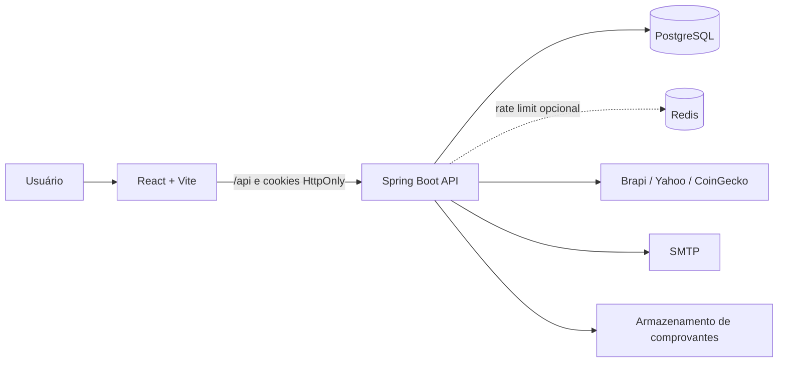

# Farol Financeiro

> Organização financeira pessoal em um só lugar: transações, análises, investimentos, desejos, comprovantes e importação de históricos.

[](https://openjdk.org/)
[](https://spring.io/projects/spring-boot)
[](https://react.dev/)
[](https://www.typescriptlang.org/)
[](https://www.postgresql.org/)
[](CHANGELOG.md)


## Sobre

O **Farol Financeiro** é uma aplicação web full-stack voltada à gestão financeira pessoal. O produto reúne o controle do dia a dia e o acompanhamento patrimonial em uma experiência única, responsiva e protegida por autenticação moderna.

O sistema foi construído como um projeto de produto real, não apenas como demonstração de CRUD. Ele trata parcelamentos, importação assistida, conciliação de comprovantes, projeções financeiras, cotações externas, recuperação de conta e administração segura.

**Aplicação:** [www.farolfinanceiro.online](https://www.farolfinanceiro.online/)

## Funcionalidades

- **Painel financeiro:** saldo, receitas, despesas, categorias e movimentações recentes.
- **Transações:** receitas e despesas, filtros, edição, exclusão e compras parceladas.
- **Análise mensal:** comparações com períodos anteriores, acumulado anual e insights explicáveis.
- **Investimentos:** catálogo de ativos, compras e vendas, preço médio, cotações, rentabilidade, proventos e evolução patrimonial.
- **Renda fixa:** cadastro de aplicações e simulador de juros compostos com aportes mensais.
- **Lista de desejos:** múltiplas listas, prioridades, descontos, histórico e conversão da compra em transação.
- **Importação financeira:** prévia e confirmação de extratos OFX, CSV, TSV, XLS e XLSX.
- **Notas fiscais:** envio em PDF, JPG ou PNG e sugestão de vínculo por valor, data e descrição.
- **Conta e segurança:** cookies `HttpOnly`, renovação de sessão, recuperação de senha e autenticação em dois fatores.
- **Administração:** visão operacional, suspensão de contas, papéis de acesso e recuperação controlada.

## Tecnologias

| Camada | Tecnologias principais |
| --- | --- |
| Frontend | React 18, TypeScript, Vite, Tailwind CSS, TanStack Query, Zustand, React Hook Form e Zod |
| Backend | Java 21, Spring Boot 4, Spring Security, Spring Data JPA, Bean Validation e Springdoc OpenAPI |
| Dados | PostgreSQL 16 em produção, H2 em desenvolvimento/testes, Flyway e Redis opcional |
| Integrações | Brapi, Yahoo Finance, CoinGecko, Cloudflare Turnstile e SMTP |
| Infraestrutura | Docker, Docker Compose, Nginx, Vercel e Render |
| Qualidade | JUnit 5, Mockito, Spring Boot Test, TypeScript e build de produção Vite |

## Arquitetura



O frontend utiliza a API pelo mesmo domínio em produção. O backend segue uma arquitetura em camadas com controllers, serviços, repositórios e entidades. A sessão é stateless no servidor e os tokens JWT ficam em cookies inacessíveis ao JavaScript.

Detalhes sobre módulos, fluxos e decisões estão na [documentação técnica](docs/README.md).

## Início Rápido

### Pré-requisitos

- Java 21
- Node.js 20 ou superior e npm
- Git
- Docker Desktop, apenas se quiser usar PostgreSQL e Redis localmente

### 1. Clonar

```bash
git clone https://github.com/Guilhermecorral/Controle-de-Gastos.git
cd Controle-de-Gastos
```

### 2. Configurar o backend

No PowerShell:

```powershell
Copy-Item backend/back/.env.example backend/back/.env
```

No Linux ou macOS:

```bash
cp backend/back/.env.example backend/back/.env
```

O perfil padrão `dev` usa banco H2 em memória. Antes de iniciar, troque ao menos `JWT_SECRET` e `APP_FIELD_ENCRYPTION_SECRET_KEY` no arquivo local.

### 3. Iniciar a API

```bash
cd backend/back
./mvnw spring-boot:run
```

No Windows também é possível usar `mvnw.cmd spring-boot:run`. A API ficará em `http://localhost:8080`.

### 4. Iniciar o frontend

Em outro terminal:

```bash
cd frontend
npm ci
npm run dev
```

Acesse `http://localhost:5173`. O Vite encaminha `/api` para `http://localhost:8080` durante o desenvolvimento.

## Testes e Build

```bash
# Backend
cd backend/back
./mvnw test

# Frontend
cd frontend
npm run build
```

O Swagger fica disponível em desenvolvimento em `http://localhost:8080/swagger-ui.html`. Em produção, Swagger e OpenAPI permanecem desabilitados.

## Estrutura do Repositório

```text
.
├── backend/back/                 API Spring Boot e migrações Flyway
├── frontend/                     Aplicação React e configuração Vercel
├── docs/                         Documentação técnica e runbook
├── infra/                        Nginx, backup e smoke tests
├── Docker-compose.yml            Ambiente local com API, PostgreSQL e Redis
├── docker-compose.prod.yml       Stack completa para produção própria
└── CHANGELOG.md                  Histórico de versões
```

## Documentação

- [Índice da documentação](docs/README.md)
- [Arquitetura e decisões técnicas](docs/ARCHITECTURE.md)
- [Desenvolvimento local e manutenção](docs/DEVELOPMENT.md)
- [Referência da API](docs/API.md)
- [Runbook de produção](docs/PRODUCTION_DEPLOY_RUNBOOK.md)
- [Histórico de versões](CHANGELOG.md)

## Segurança e Privacidade

- Não envie arquivos `.env`, segredos JWT, credenciais SMTP ou chaves de provedores ao Git.
- Os tokens de sessão são transportados por cookies `HttpOnly`; o frontend não armazena JWT no `localStorage`.
- Os dados são isolados por usuário nos serviços e repositórios.
- Operações administrativas exigem papel `ADMIN` e uma lista controlada de e-mails autorizados.
- Comprovantes podem conter dados sensíveis e exigem armazenamento persistente e acesso restrito em produção.

Para relatar uma vulnerabilidade, prefira um contato privado com o mantenedor em vez de abrir uma issue pública com detalhes exploráveis.

## Estado do Projeto

A versão atual é a **1.3.3**. O desenvolvimento segue incrementalmente pelo [changelog](CHANGELOG.md), com foco atual na evolução da carteira de investimentos e na conciliação tributária.

## Autoria

Desenvolvido por [Guilherme Corral](https://github.com/Guilhermecorral).
