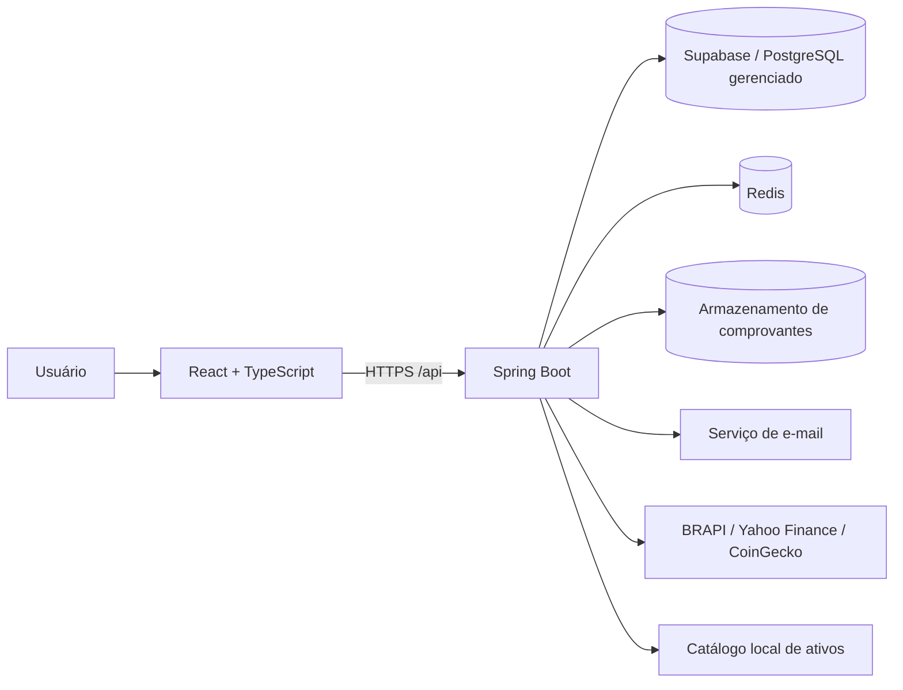
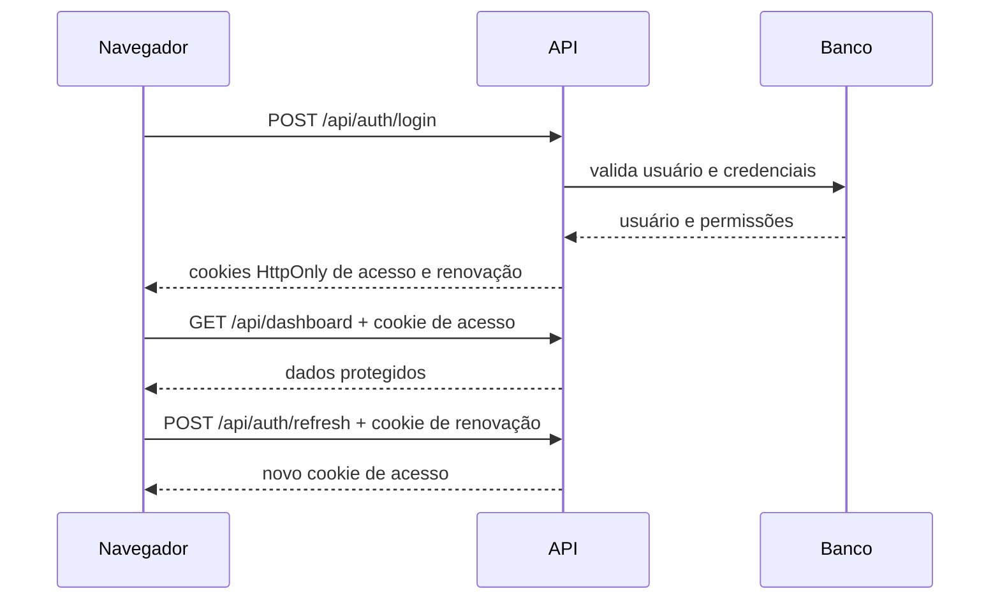
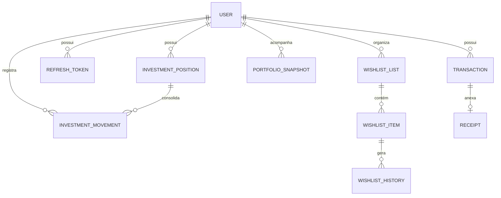
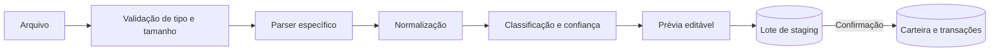
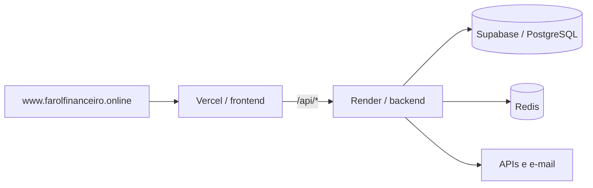

# Arquitetura do Farol Financeiro

Este documento apresenta a arquitetura técnica da versão estável 1.4.5 do Farol Financeiro. Ele descreve os componentes, as responsabilidades de cada módulo e os fluxos que exigem mais cuidado ao evoluir o sistema.

## Visão geral

O Farol Financeiro é uma aplicação web dividida em um frontend React e uma API Spring Boot. O navegador acessa a API pelo prefixo `/api`; em desenvolvimento, o Vite encaminha essas chamadas para o backend e, em produção, o domínio público faz o mesmo por meio da infraestrutura de hospedagem.

No ambiente de desenvolvimento, o PostgreSQL pode ser substituído pelo H2 em memória e o rate limit pode operar sem Redis.

## Componentes

| Componente | Responsabilidade |
| --- | --- |
| Frontend | Interface, rotas, formulários, estado de sessão, consultas e visualizações |
| API | Regras de negócio, autenticação, validação, integrações e persistência |
| Supabase / PostgreSQL | Banco PostgreSQL gerenciado usado em produção; o backend acessa via JDBC e aplica as migrações Flyway |
| Redis | Estado compartilhado para limitação de requisições em produção |
| Provedores de mercado | Catálogo e cotações de ações, FIIs, ativos dos EUA e criptoativos |
| Armazenamento | Comprovantes vinculados às transações |
| E-mail | Recuperação de senha e comunicações transacionais |

## Organização do frontend

O frontend fica em `frontend/` e usa React 18, TypeScript, Vite, Tailwind CSS, TanStack Query, Zustand, React Hook Form e Zod.

As responsabilidades principais são:

- `src/components`: componentes reutilizáveis e elementos de interface.
- `src/pages`: composição das telas e fluxos de navegação.
- `src/services`: comunicação HTTP e adaptação dos contratos da API.
- `src/stores`: estado global que não pertence ao cache do servidor.
- `src/hooks`: comportamento reutilizável entre componentes.
- `src/schemas`: validações dos formulários e dados de entrada.

TanStack Query deve ser a fonte de verdade para dados remotos. Zustand deve ser reservado para estado de interface ou sessão que não seja naturalmente representado pelo cache de requisições.

## Organização do backend

O backend fica em `backend/back/` e usa Java 21 e Spring Boot. Os pacotes são organizados por domínio, mantendo controller, service, entidades, repositórios e DTOs próximos da funcionalidade que atendem.

| Domínio | Responsabilidade |
| --- | --- |
| `auth` e `security` | Login, registro, cookies JWT, renovação, 2FA, CAPTCHA e rate limit |
| `user` | Perfil, preferências, exclusão de conta e configuração de 2FA |
| `transactions` | Receitas, despesas, comprovantes e importações |
| `dashboard` | Indicadores consolidados do painel |
| `monthlyanalysis` | Agregações mensais de receitas, despesas e categorias |
| `investments` | Catálogo, posições, movimentações, cotações, proventos e projeções |
| `wishlist` | Listas de desejos, histórico, importação e conversão em compra |
| `admin` | Visão operacional e gestão controlada de usuários |
| `ofxupload` | Leitura e normalização de extratos financeiros |

Os controllers tratam HTTP e validação de entrada; services concentram regras de negócio; repositories isolam a persistência; DTOs definem os contratos externos. Entidades JPA não devem ser usadas como resposta pública da API.

## Fluxo de autenticação

A API usa access token assinado e refresh token persistido. O token de acesso é enviado em cookie `HttpOnly` com escopo geral, enquanto o de renovação possui escopo restrito à rota de autenticação, é armazenado por hash no PostgreSQL e rotacionado ao renovar a sessão. Sem access token válido, `GET /api/auth/me` responde 401 para que o frontend solicite a renovação; com `JWT_SECRET` fixo no ambiente, reinícios não invalidam sessões válidas. Em produção, os cookies usam transporte seguro e as origens permitidas são configuradas explicitamente.

O segundo fator usa TOTP. O segredo é armazenado de forma cifrada; por isso, a chave de criptografia da aplicação deve ser tratada como segredo de produção e nunca versionada.

## Modelo de dados conceitual

As posições de investimento representam o estado consolidado. Compras, vendas e proventos são fatos históricos e não devem ser apagados apenas para ajustar o saldo; correções devem preservar rastreabilidade sempre que possível. A única exceção operacional é o reset administrativo explícito de uma conta de homologação: ele apaga todo o domínio financeiro em uma transação, inclusive comprovantes e staging, mas preserva `users`, autenticação, papel, status e 2FA para permitir um novo cenário de teste.

## Investimentos e cotações

A identificação do ativo é orientada por catálogo. O usuário pesquisa por código ou nome, por exemplo `BBAS3`, `PETR4`, `ITUB4` ou `BBDC3`, e seleciona um ativo conhecido pelo sistema. Isso reduz cadastros inválidos e permite associar mercado, moeda e provedor.

A camada de mercado tenta obter dados em provedores externos e mantém um catálogo local como fallback. A resposta de cotação informa a fonte e o horário de atualização para que a interface não apresente um valor como se fosse tempo real quando ele não é.

Criptoativos usam a CoinGecko: a cotação do dia consulta o preço em tempo real e expira em cinco minutos; uma data passada consulta o histórico diário em BRL e usa chave de cache por ativo/data com validade longa. A cotação histórica é somente uma sugestão para o formulário, e o preço confirmado pelo usuário permanece como custo da operação.

A rentabilidade da posição compara o custo médio das compras com a cotação atual. Proventos permanecem separados do ganho de capital, permitindo analisar valorização e renda recebida sem misturar os conceitos.

O piloto de proventos B3 usa uma fonte pública sem SLA. O backend autoriza a prévia e a publicação apenas para administradores ou e-mails configurados no ambiente; dados ambíguos por ticker/ISIN são devolvidos para revisão e nunca viram receita antes da confirmação manual.

## Importação de dados

O pipeline de extratos aceita OFX, CSV, TSV, XLS e XLSX. Para investimentos, CSV, Excel e OFX de investimentos entram primeiro em tabelas de staging, recebem alertas de duplicidade e só são transformados em compras ou vendas após a confirmação explícita do usuário.

Comprovantes PDF, JPG e PNG seguem um fluxo próprio. A associação automática deve ser tratada como sugestão quando houver ambiguidade, nunca como prova contábil definitiva.

O parser SINACOR de nota B3 em PDF é uma entrada experimental de staging, controlada por `APP_INVESTMENTS_IMPORTS_PDF_ENABLED`. Ele aceita apenas PDF nativo com texto selecionável, produz uma prévia editável e nunca cria lançamento sem confirmação; OCR, documentos escaneados e layouts não validados continuam fora do suporte.

A Agenda B3 é um piloto manual protegido por `APP_INVESTMENTS_CORPORATE_EVENTS_PILOT_ENABLED` e pela lista `APP_INVESTMENTS_CORPORATE_EVENTS_PILOT_EMAILS`; contas `ADMIN` também podem acessá-la. Mesmo habilitada, a sincronização automática permanece desligada por `APP_INVESTMENTS_CORPORATE_EVENTS_AUTOMATIC_SYNC_ENABLED=false`: a B3 gera somente uma prévia e uma receita `INVESTIMENTO` só é criada ao confirmar o recebimento.

## Migrações

O PostgreSQL de produção é versionado com Flyway em `backend/back/src/main/resources/db/migration/`. Migrações aplicadas são imutáveis: qualquer correção deve ser criada em um novo arquivo `V<n>__descricao.sql`.

O perfil de desenvolvimento usa H2 para inicialização rápida. Como H2 e PostgreSQL não são idênticos, mudanças de esquema ou consultas específicas precisam ser verificadas também no ambiente Docker com PostgreSQL.

## Topologia de produção

Detalhes operacionais, variáveis e critérios de rollback estão no [runbook de produção](PRODUCTION_DEPLOY_RUNBOOK.md).

## Segurança e privacidade

- Senhas são armazenadas por hash, nunca em texto puro.
- Tokens de sessão são enviados em cookies `HttpOnly`.
- Rotas administrativas exigem autorização específica no backend.
- Login e recuperação de senha possuem limitação de requisições.
- CAPTCHA pode ser exigido conforme a configuração do ambiente.
- Segredos, arquivos `.env`, bancos locais e comprovantes não devem entrar no Git.
- Logs não devem expor senha, token, segredo TOTP ou conteúdo integral de documentos.

### Supabase e Row Level Security

O frontend não possui `@supabase/supabase-js`, não cria cliente Supabase e não chama `rest/v1` ou `auth/v1`; as chamadas da interface seguem para `/api` e passam pelo backend Spring. Em produção, o backend se conecta ao PostgreSQL gerenciado pelo Supabase por JDBC, inclusive pelo pooler, e executa a persistência JPA/Flyway. Portanto, autorização de proprietário e papéis continua sendo responsabilidade do backend e a API permanece stateless.

Estado auditado em 2026-09-09: as migrações versionadas não contêm `ENABLE ROW LEVEL SECURITY` nem `CREATE POLICY`. A verificação ao vivo de `pg_class.relrowsecurity` e `pg_policies` não foi concluída porque a conexão somente leitura com o pooler expirou durante o handshake SSL, e o console web não ficou acessível no ambiente de auditoria. Assim, não há evidência suficiente para afirmar se RLS está habilitado por tabela ou se existem policies no banco de produção; esse controle deve ser tratado como **não confirmado**, e não como proteção ativa.

Antes de liberar acesso direto do navegador ao Supabase ou declarar RLS como controle concluído, consultar todas as tabelas de `public` em `pg_class` e `pg_policies`, registrar RLS/policies por tabela e testar os papéis `anon` e `authenticated`. RLS habilitado sem policy nega o acesso desses papéis por padrão, mas a conta JDBC usada pelo backend pode ter privilégios diferentes; por isso, RLS não substitui as verificações de autorização do Spring.

## Limites atuais

- Os provedores de mercado podem impor rate limits, indisponibilidade ou atraso nas cotações.
- O catálogo prioriza Brasil e Estados Unidos; cobertura realmente global é uma evolução futura.
- Os indicadores tributários são informativos e não substituem orientação contábil.
- A persistência H2 de desenvolvimento é efêmera por padrão.
- A consistência visual e funcional deve ser validada em desktop e mobile antes de cada release.

## Princípios para evolução

1. Regras financeiras críticas pertencem ao backend e precisam de testes unitários.
2. Contratos públicos devem usar DTOs e manter compatibilidade ou ter migração explícita.
3. Dados de mercado devem sempre expor fonte e data de atualização.
4. Operações de compra, venda e provento devem preservar histórico auditável.
5. Novas integrações devem falhar de forma controlada, sem impedir acesso aos dados já persistidos.
