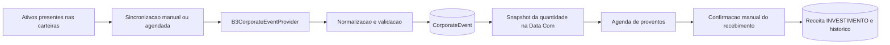

# Roadmap do Produto

Atualizado em 06/09/2026. Este documento e a referencia de continuidade para as proximas evolucoes do Farol Financeiro. Ele registra o que ja foi decidido, o que precisa ser validado e os criterios para considerar cada entrega pronta.

## Estado atual

- Versao em desenvolvimento: `1.4.5-beta.1`.
- A carteira ja se integra ao fluxo financeiro para compra, venda, aplicacao, resgate e confirmacao de proventos.
- A importacao de investimentos por CSV, Excel e OFX usa staging, revisao editavel e confirmacao explicita antes de alterar a carteira.
- A Agenda de Proventos esta pronta no produto, mas a fonte de eventos ainda e `MOCK`; portanto nao deve ser apresentada como dado de mercado real.
- O refresh token e persistido e rotacionado. A recuperacao apos `F5` foi corrigida para disparar o refresh quando nao houver access token; a verificacao final de cookies e proxy deve acompanhar o proximo deploy.

Documentos relacionados:

- [Investimentos 1.4](INVESTMENTS-1.4.md): escopo, regras tributarias e endpoints ja entregues.
- [Arquitetura](ARCHITECTURE.md): limites de dados de mercado, importacao e principios de evolucao.
- [Runbook de producao](PRODUCTION_DEPLOY_RUNBOOK.md): variaveis e verificacoes operacionais.

## Ajustes rapidos e estabilidade

Estes itens devem ser investigados antes de novas telas grandes. Nao exigem mudanca de versao por si so; entram na proxima release que os concluir.

### Persistencia de sessao apos reinicio

**Problema observado:** depois de o backend do Render parar e voltar, atualizar a pagina pode deslogar mesmo com access token e refresh token configurados.

**Hipotese de trabalho:** a causa pode estar fora da existencia dos tokens. Precisamos confirmar o fluxo completo entre navegador, proxy, backend e PostgreSQL antes de alterar autenticacao.

**Roteiro de diagnostico:**

1. Registrar no navegador o resultado de `POST /auth/refresh` apos o `F5`: status HTTP, resposta e se o cookie de refresh foi enviado. Nunca registrar o valor do token.
2. Conferir atributos do cookie em producao: `Domain`, `Path`, `Secure`, `HttpOnly`, `SameSite` e data de expiracao.
3. Confirmar que `JWT_SECRET` permanece igual entre deploys e que o banco PostgreSQL de producao contem o refresh token nao revogado e nao expirado.
4. Conferir se Vercel, Render e Nginx preservam `Set-Cookie` e cabecalhos de origem/credenciais no proxy para `/api/*`.
5. Criar teste de integracao que emita um refresh token, reinicie o contexto Spring sem apagar o banco e confirme a renovacao da sessao.

**Criterio de aceite:** o usuario permanece autenticado depois de refresh da pagina e reinicio controlado do backend, enquanto o refresh token estiver valido, nao revogado e o cookie estiver presente.

### Importacao tambem pelo Historico Financeiro

**Objetivo:** manter a aba "Importar investimentos" em Investimentos e disponibilizar uma entrada equivalente em Historico Financeiro, para que o usuario encontre a importacao pelo contexto em que estiver trabalhando.

**Decisao de UX:** as duas entradas devem abrir o mesmo fluxo de revisao. Nao devem existir dois parsers ou duas regras de confirmacao.

**Escopo:**

1. Adicionar acao de importacao no Historico Financeiro.
2. Permitir escolher ou detectar o destino: extrato financeiro ou movimentacoes de investimento.
3. Reaproveitar staging, alertas de duplicidade, edicao de linha e confirmacao existente.
4. Mostrar claramente, antes da confirmacao, se o arquivo criara transacoes financeiras, movimentos de carteira ou ambos.

**Criterio de aceite:** importar o mesmo arquivo pelo Historico Financeiro ou por Investimentos produz a mesma previa e exige a mesma confirmacao explicita.

## v1.4.3 - Investimentos conectados ao mercado

### Objetivo

Substituir a agenda de proventos de demonstracao por uma rotina rastreavel que consulte eventos corporativos reais, calcule a elegibilidade na Data Com e mantenha o usuario no controle da conciliacao. Esta versao tambem prepara a importacao de notas de corretagem em PDF, sem aceitar lancamentos automaticos sem revisao.

### Status da entrega

| Item | Status | Observacao |
| --- | --- | --- |
| Renovacao de sessao apos F5 | Entregue | O backend retorna 401 sem access token, acionando o refresh token persistido no fluxo ja existente do frontend. A confirmacao de cookie/proxy segue obrigatoria no proximo deploy. |
| Entrada no Historico Financeiro | Entregue | Reutiliza exatamente o mesmo dialogo de staging e confirmacao de Investimentos. |
| Coletor B3 | Parcial | Adaptador experimental, manual e configuravel preserva Data Com e pagamento para os ativos da carteira. Ainda requer validacao semantica com RI e observacao de cobertura real. |
| PDF SINACOR nativo | Parcial | Operacoes, custos e IRRF alimentam apenas a previa revisavel. Nao cobre OCR, PDF escaneado nem todo layout de corretora. |

## v1.4.4 - Estabilidade de compra, venda e agenda

| Item | Status | Observacao |
| --- | --- | --- |
| Atualizacao apos compra/venda | Entregue | A invalidacao e limitada a Carteira, Transacoes, Painel e Analise Mensal; o fechamento do modal nao volta a invalidar todas as consultas. |
| Compra retroativa | Entregue | Regressao cobre BBAS3: operacao anterior a Data Com persiste, cria fluxo financeiro e entra no snapshot elegivel. |
| Agenda em modo MOCK | Esclarecido | A fonte demonstrativa permanece para testes. Ela nao consulta proventos reais e uma compra posterior a Data Com nao pode receber o evento. |

### Fonte de eventos corporativos

**Direcao aprovada para validacao:** usar a metodologia observada no projeto aberto [b3-pipeline-data-and-backtest-framework](https://github.com/nickmaglowsch/b3-pipeline-data-and-backtest-framework) como referencia tecnica, mas implementar um coletor proprio e reduzido no Farol. O projeto nao deve ser copiado integralmente: ele foi projetado para pesquisa e backtests em Python/Rust/SQLite, enquanto o Farol usa Java/Spring/PostgreSQL.

**Estado da investigacao:**

- A resposta principal consultada na B3 retornou eventos de PETR, BBAS e MXRF, inclusive `label`, `rate`, `isinCode`, `lastDatePrior` e `paymentDate`.
- O pipeline de referencia descarta `paymentDate` no modelo final.
- Para MXRF, a resposta principal trouxe eventos, mas a pagina de dividendos usada pelo pipeline retornou vazia. Portanto, o Farol deve preservar a resposta principal e nao depender somente da paginação secundaria.
- A cobertura de FIIs foi observada em MXRF; a de Fiagros ainda precisa ser testada com exemplos reais antes de entrar como promessa de produto.
- O endpoint pesquisado e publico, mas nao e uma API B3 contratada/documentada com SLA. Ele deve ser tratado como fonte experimental, com baixo volume, monitoramento e alternativa manual.

**Arquitetura alvo:**

**Dados minimos a persistir por evento:**

- fonte, identificador externo, horario da consulta e versao do parser;
- ticker e ISIN mapeado, sem depender apenas do nome da empresa;
- tipo: dividendo, JCP, rendimento ou outro evento que exija revisao;
- valor bruto por cota, IRRF previsto, valor liquido previsto;
- data de anuncio, Data Com, data ex e data de pagamento quando fornecidas;
- observacao/origem do documento e hash do payload bruto para auditoria;
- estado de validacao: `IMPORTADO`, `EM_REVISAO`, `PUBLICADO` ou `CANCELADO`.

**Regras de seguranca e produto:**

1. Provento importado nunca aumenta o saldo sozinho.
2. A posicao elegivel e congelada na Data Com; venda posterior nao remove o direito ja adquirido.
3. JCP deve mostrar bruto, IRRF de 15% previsto e liquido separadamente.
4. Falha da fonte nao apaga eventos ja persistidos; ela apenas marca a agenda como desatualizada.
5. A primeira versao deve sincronizar somente ativos presentes nas carteiras e com limite serial conservador. Nao executar varredura de toda a B3 nem reproduzir alta concorrencia do projeto de referencia.

**Plano de validacao antes da implementacao produtiva:**

1. Obter retorno do autor do projeto sobre licenca, cobertura e cuidados operacionais.
2. Conferir tres eventos conhecidos de acoes em documentos de RI para provar que `lastDatePrior` representa a Data Com antes de usar esse nome no Farol.
3. Validar pelo menos tres FIIs e tres Fiagros: existencia do evento, valor por cota, Data Com e pagamento.
4. Criar testes de integracao para duplicidade, alteracao/cancelamento de evento e snapshot apos venda posterior.
5. Manter sincronizacao por botao "Atualizar agenda" enquanto a confiabilidade da fonte estiver em observacao.

**Criterio de aceite:** um evento real validado cria apenas uma previsao; ao chegar a data de pagamento, o usuario confere e confirma, e so entao nasce uma receita `INVESTIMENTO` vinculada ao evento.

### Papel das APIs de mercado

As APIs continuam importantes, mas com responsabilidades separadas:

| Necessidade | Fonte inicial | Observacao |
| --- | --- | --- |
| Cotacoes B3 em lote | APIBrasil | Cache compartilhado planejado; validar consumo real de creditos. |
| Cotacao B3 individual/fallback | BRAPI e Yahoo Finance | BRAPI deve usar credencial em cabecalho, nunca na URL. |
| Cripto | CoinGecko | Fonte dedicada para preco e variacao de cripto. |
| Proventos brasileiros | Coletor B3/CVM experimental | Fonte rastreavel, com revisao manual e sem saldo automatico. |
| Dados globais e contingencia | A definir | Nao prometer cobertura global antes de fonte licenciada/validada. |

O cache de cotacoes deve ser evoluido de memoria local para armazenamento compartilhado (PostgreSQL ou Redis), com fonte, horario, validade e ultimo valor conhecido. Isso evita multiplicar chamadas quando houver mais de uma instancia do backend.

### Importacao de PDF de investimentos

**Objetivo:** importar notas de corretagem e documentos de investimentos como pre-visualizacao revisavel, nunca como escrita direta na carteira.

**Fase 1 - Estrutura e seguranca:**

1. Aceitar somente PDF nativo baixado da corretora. PDFs escaneados ficam como "nao suportado nesta fase"; OCR e uma evolucao separada.
2. Criar adaptador de parser por corretora/layout, iniciando por uma nota SINACOR validada.
3. Extrair ticker, tipo de operacao, quantidade, preco, data, corretagem, taxas B3, outros custos e IRRF quando houver confianca suficiente.
4. Enviar tudo para a mesma tela de staging de CSV/Excel/OFX, com avisos por campo e possiveis duplicidades.
5. Salvar arquivo, hash, corretora detectada, versao do parser e resultado da revisao para auditoria.

**Fase 2 - Cobertura gradual:**

- Manter uma matriz de layouts suportados por corretora e data de validacao.
- Adicionar um layout apenas com amostras anonimizadas, testes automatizados e revisao humana obrigatoria.
- Nao fazer scraping de Status Invest, Investidor10 ou paginas protegidas para preencher documentos ou proventos. Sites de terceiros podem bloquear o acesso, mudar layout e nao oferecem contrato de dados.

**Criterio de aceite:** o usuario revisa cada operacao detectada e seleciona o que efetivar; um erro de leitura jamais pode criar movimentacao sem confirmacao.

### Fora do escopo da v1.4.3

- API externa licenciada para cobertura global.
- Importacao automatica de PDF escaneado por OCR.
- Day trade completo, cripto/exterior e classificacao fiscal avancada.
- Creditar proventos sem conciliacao humana.

## v1.4.5-beta.1 - Agenda B3 em piloto controlado

### Objetivo

Permitir que administradores e contas liberadas por ambiente validem previsões reais de proventos, sem criar saldo automaticamente e sem expor a fonte experimental a usuários comuns.

### Regras do piloto

- Acesso apenas com `APP_INVESTMENTS_CORPORATE_EVENTS_PILOT_ENABLED=true` e e-mail em `APP_INVESTMENTS_CORPORATE_EVENTS_PILOT_EMAILS`, ou papel `ADMIN`.
- `APP_INVESTMENTS_CORPORATE_EVENTS_SYNC_CRON` permanece `-`; a atualização é manual e passa por prévia.
- A B3 produz candidatos para os últimos 90 e os próximos 180 dias. O usuário seleciona quais previsões publicar.
- Evento ambíguo por ticker/ISIN, sem posição ou sem cotas na Data Com não entra na Agenda.
- Receita só nasce em `Confirmar recebimento`; previsões podem ser corrigidas ou canceladas.

### Critério para promover a 1.4.5

Validar ações, FIIs e FIAGROs contra documentos do emissor por ciclos suficientes, sem associação incorreta de classe de ação, duplicidade ou crédito financeiro automático.

## v1.4.6 - Central de tributos da pessoa fisica

### Objetivo

Transformar impostos ja conhecidos pelo usuario em obrigacoes financeiras organizadas, com vencimento, estimativa, comprovante e confirmacao de pagamento. A proposta e complementar a Tributacao e Conciliacao de investimentos: investimentos continuam com regras e DARF proprias; a Central apresenta a visao geral das obrigacoes pessoais sem fingir substituir contador, declaracao oficial ou sistema governamental.

### Escopo viavel para uma primeira entrega

- Painel de obrigacoes: `A PAGAR`, `PAGA`, `ATRASADA`, `ISENTA` ou `EM REVISAO`.
- Cadastro manual e assistido de IRPF/DARF, IPVA, IPTU e outras taxas ou tributos recorrentes.
- Competencia, vencimento, valor previsto, valor efetivamente pago, orgao cobrador, referencia e comprovante.
- Vencimentos e alertas no painel/calendario, sem assumir que o aviso substitui a guia oficial.
- Botao de confirmar pagamento que cria uma despesa vinculada somente apos o usuario informar valor, data e conta de origem.
- Separacao clara entre "estimativa", "guia emitida" e "pagamento realizado" para nao reduzir o saldo antes da hora.
- Integracao com o DARF de investimentos ja existente, evitando duplicar uma mesma obrigacao em duas telas.

### Regras de produto

1. O Farol organiza e estima; ele nao apresenta calculo fiscal geral como valor oficial sem fonte, vigencia e informacoes completas do usuario.
2. Nenhuma obrigacao cria despesa, reduz saldo ou marca imposto como quitado sem confirmacao de pagamento.
3. Imposto retido na fonte e exibido como informacao de liquidacao, nao como nova conta a pagar.
4. Cada obrigacao deve manter origem: manual, investimento, importacao, documento ou fonte externa validada.
5. Regras, aliquotas e vencimentos precisam carregar competencia e vigencia. Mudancas legais nao podem reescrever historico ja confirmado.

### Limites da primeira entrega

- Nao calcular automaticamente IRPF anual, carnê-leao, IPVA ou IPTU a partir de dados incompletos.
- Nao gerar, transmitir ou pagar guia oficial em nome do usuario.
- Nao inferir dividas fiscais por movimentacao bancaria sem revisao humana.
- Nao incluir regras empresariais nesta versao.

### Criterio de aceite

O usuario consegue visualizar uma obrigacao, saber se ela e somente prevista ou ja paga, anexar/referenciar comprovante e registrar a despesa real sem duplicar o fluxo financeiro.

## v1.5.0 - Grupos e recorrencia financeira

### Grupos financeiros

O recurso de grupos ja fazia parte do escopo do produto, mas esta pausado. Antes de iniciar desenvolvimento, devemos definir o caso principal: familia, casal, amigos, divisao de despesas ou acompanhamento por responsavel. Essa escolha determina regras de membros, permissao, privacidade e rateio.

**Pre-requisitos de produto:** definir criador do grupo, papeis, visibilidade de saldo, forma de convite, saida/remoção e se transacoes pessoais podem ser compartilhadas.

### Receitas e despesas recorrentes

**Objetivo:** permitir que o usuario marque uma previsao como recorrente sem fingir que o valor ja foi pago ou recebido. Exemplo: aluguel mensal pode existir ate uma data definida, ser cancelado quando necessario e variar de valor ao longo do tempo.

**Modelo proposto:** `RecurrenceRule` associada a uma transacao-modelo, sem criar um novo tipo financeiro.

**Campos minimos:**

- tipo, categoria, descricao e conta/pagamento sugeridos;
- frequencia inicial: mensal, semanal ou personalizada;
- data inicial e encerramento opcional; sem encerramento significa "ate eu cancelar";
- valor esperado, com possibilidade de editar apenas uma ocorrencia ou alterar as proximas;
- estado: ativa, pausada, encerrada;
- regra para fim de semana/feriado, se adotada em versao posterior.

**Comportamento esperado:**

1. O calendario e a analise mensal mostram a previsao como recorrente, separada de realizado.
2. No periodo previsto, o usuario confirma, edita, ignora ou adia a ocorrencia.
3. Somente a confirmacao cria uma transacao financeira real e altera o saldo.
4. Alterar o aluguel de um mes nao reescreve historico ja confirmado.
5. Alterar a regra pode valer apenas para aquela ocorrencia ou para as proximas; a escolha deve ser explicita.

**Criterio de aceite:** uma recorrencia de aluguel com valor variavel pode ser acompanhada ate uma data ou sem prazo final, sem duplicar 
transacoes e sem alterar valores historicos confirmados.

## v1.6.0 ou posterior - Tributacao empresarial

### Por que este escopo e maior

O controle empresarial depende de regime tributario, CNAE, faturamento, servicos ou mercadorias, estado, municipio, folha de pagamento, notas fiscais, creditos e obrigacoes acessorias. IRPJ, CSLL, PIS/Cofins, ISS, ICMS, IPI, INSS e DAS nao podem ser calculados com seguranca por uma regra unica.

### Decisao de sequenciamento

Somente iniciar esta frente depois de concluir a Central de Tributos PF e escolher claramente o posicionamento do produto:

- **Organizador empresarial:** agenda, anexos, pagamentos, contas a pagar e relatorios; menor risco e bom primeiro passo.
- **Assistente tributario:** estimativas por regime com dados declarados; exige regras versionadas, validacao juridico-contabil e muitos limites explicitos.
- **Integracao contabil/fiscal:** leitura de notas, folha, declaracoes ou APIs de escritorio; depende de parceiros, autorizacoes e tratamento rigoroso de dados sensiveis.

### Pre-requisitos

1. Definir se o Farol atendera PF e PJ na mesma conta ou em espacos financeiros separados.
2. Definir o primeiro regime suportado, sem prometer todos ao mesmo tempo.
3. Validar regras com fonte oficial e revisao contabil antes de codificar qualquer calculo.
4. Projetar isolamento de dados empresariais, membros, permissoes e auditoria antes de importar notas ou folha.

**Classificacao atual:** nao e recomendada como `v1.4.5` completa. Um organizador de obrigacoes pode ser iniciado apos a v1.4.3; calculo tributario empresarial completo pertence a `v1.6.0` ou posterior.

## Decisoes pendentes

| Assunto | Decisao necessaria | Impacto |
| --- | --- | --- |
| Fonte B3/CVM | Confirmar termos, permissao do autor e comportamento dos endpoints | Define se o provedor experimental pode deixar o modo de observacao. |
| Data Com | Validar semanticamente `lastDatePrior` em documentos de RI | Evita congelar quantidade na data errada. |
| Fiagros | Escolher ativos de teste e comprovar cobertura | Define a promessa de cobertura inicial. |
| PDF | Escolher primeira corretora e obter notas anonimizadas | Define o primeiro layout suportado. |
| Sessao | Registrar evidencia do `F5` em producao sem expor tokens | Define a causa real do logout. |
| Grupos | Definir caso de uso e modelo de permissao | Evita construir colaboracao sem regra de privacidade. |
| Recorrencia | Confirmar se notificacoes e lembretes fazem parte da primeira fase | Define a experiencia de confirmacao mensal. |

## Como retomar este roadmap

1. Registrar a resposta do autor do pipeline e atualizar a secao de fonte B3/CVM.
2. Executar os casos de validacao de acoes, FIIs e Fiagros antes de habilitar eventos reais.
3. Validar em producao os atributos do cookie e o fluxo de refresh sem expor tokens.
4. Transformar o proximo bloco validado em escopo fechado, com testes e criterio de aceite antes de mudar telas.
5. Ao fechar uma versao, sincronizar README, CHANGELOG, `package.json`, `pom.xml`, runtime e documentos tecnicos conforme a regra permanente de versao.
